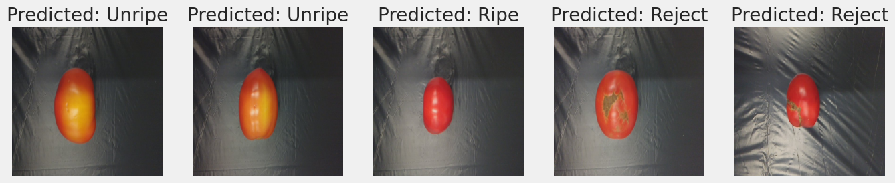

# Tomato Classification using EfficientNet-B7


## Overview
This project uses the **EfficientNet-B7** deep learning model for classifying different types of tomatoes. The goal is to explore transfer learning for achieving high accuracy on a multi-class classification problem. 
## Features
- Multi-class tomato classification.
- Efficient transfer learning with **EfficientNet-B7**.
- High accuracy and performance optimization.
- Visualizations of training and results.
## Dataset
- **Source:** Mention where the dataset came from (e.g., Kaggle, public dataset, etc.).
- **Size:** The dataset contains two batches each with 2400 images of tomatoes for binary and multiclass classification
- **Link:**(https://data.mendeley.com/datasets/x4s2jz55dx/1).
## Results
- **Accuracy:** Achieved an accuracy of [add your accuracy, e.g., 95%].
- **Loss:** Final loss value: [add the loss value].
- 
- **Confusion Matrix:** Add a description or image of the confusion matrix.
- 


## Technology Stack
- **Programming Language:** Python
- **Frameworks:** TensorFlow, Keras
- **Libraries:** NumPy, Pandas, Matplotlib
- **Model Architecture:** EfficientNet-B7
## Installation
1. Clone the repository:
   ```bash
   git clone <repository-link>
2. Install dependencies:
   ```bash
   pip install -r requirements.txt
3. Run the notebook:
    ```bash
    Tomato_Classification_EfficientNetB7.ipynb

---

### **8. How It Works**
Describe your workflow in steps.
```markdown
## How It Works
1. **Data Preprocessing:** Load, augment, and preprocess images.
2. **Model Training:** Use transfer learning with EfficientNet-B7.
3. **Evaluation:** Measure model accuracy, precision, recall, and F1-score.
4. **Visualization:** Visualize the classification results and performance metrics.


## Screenshots





## Acknowledgements

- Dataset Source:[ [Dataset Name/Link]](https://data.mendeley.com/datasets/x4s2jz55dx/1)
- Frameworks: TensorFlow and Keras
- EfficientNet paper: [EfficientNet: Rethinking Model Scaling for Convolutional Neural Networks](https://arxiv.org/abs/1905.11946)


## Authors

- **Deborina Barman** - *Developer and Author*  
  [GitHub Profile](https://github.com/yourusername) | [LinkedIn](https://linkedin.com/in/yourprofile)


